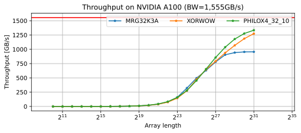

# curand_fp16

A library for generating pseudo random FP16 numbers

## Throughput



## Requirements
- C++ >= 17
- cmake >= 3.18
- CUDA
- cuRAND

## Supported algorithms

- XORWOW
- MRG32K3A
- PHILOX4_32_10

## Build
```
mkdir build
cd build
cmake .. --DCMAKE_INSTALL_PREFIX=/path/to/install
make -j4
make install
```

## Sample codes
```cpp
// main.cu
// nvcc -std=c++14 -I/path/to/include main.cu
#include <curand_fp16/curand_fp16.hpp>

constexpr std::size_t N = 1lu << 30;
constexpr auto rng = CURAND_RNG_PSEUDO_XORWOW;

int main() {
  half* ptr;
  cudaMallocManaged(&ptr, sizeof(half) * N);

  mtk::curand_fp16::generator_t generator;
  mtk::curand_fp16::create(generator, rng);
  mtk::curand_fp16::set_seed(generator, 0);

  mtk::curand_fp16::uniform(generator, ptr, N, pm);

  mtk::curand_fp16::destroy(generator);
  cudaFree(ptr);
}
```

See [tests](./tests/) for more.

## License
MIT
